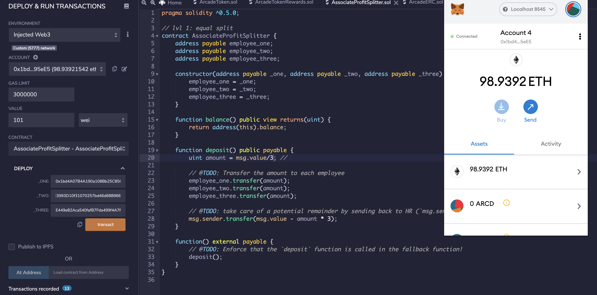

# Startup-Smart-Contract

This code will create an Ethereum-compatible blockchain to be able to build smart contracts. This will enable your company to automate finances for increased transparency and to make accounting and auditing practically automatic!

I have created 2 'Profit Splitter' contracts designed to:

1. Pay employees quickly and easily.
2. Distribute profits to different tiers of employees.

## Contract 1 - Associate Splitter

This contract is designed to accept Ether into the contract and divide the Ether evenly among three associate-level employees. This will allow your company's Human Resources department to pay employees quickly and efficiently.

Refer to the AssociateProfitSplitter.sol file for the detailed code.

When deploying the contract in Remix, deploy the contract to your local Ganache chain by connecting to Injected Web3 and ensuring MetaMask is pointed to localhost:8545. See screenshot below with code in Remix and Metamask window open on the right.

You will need to fill in the constructor parameters with your designated employee addresses.

Test the deposit function by sending various values. Keep an eye on the employee balances as you send different amounts of Ether to the contract and ensure the logic is executing properly.

## Contract 2 - Tiered Profit Splitter

This contract will distribute different percentages of incoming Ether to employees at different tiers/levels. For example in this contract, the CEO gets paid 60%, CTO 25%, and Bob the Associate gets 15%.

Refer to the screenshot below of the solidity code with the environment, contract inputs and MetaMask setup required to execute the contract.

